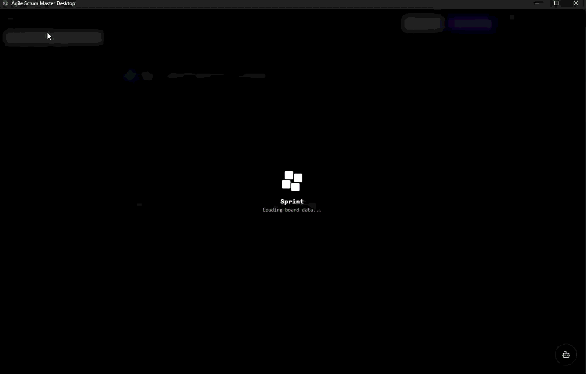

<div align="center">

<table>
      <tr>
            <td valign="middle" style="padding-right:18px;">
                  
            </td>
            <td valign="middle">
                  <pre style="font-size:20px; line-height:1.04; margin:0; text-align:left;">
███████╗██████╗ ██████╗ ██╗███╗   ██╗████████╗
██╔════╝██╔══██╗██╔══██╗██║████╗  ██║╚══██╔══╝
███████╗██████╔╝██████╔╝██║██╔██╗ ██║   ██║
╚════██║██╔═══╝ ██╔══██╗██║██║╚██╗██║   ██║
███████║██║     ██║  ██║██║██║ ╚████║   ██║
╚══════╝╚═╝     ╚═╝  ╚═╝╚═╝╚═╝  ╚═══╝   ╚═╝
                  </pre>
            </td>
      </tr>
</table>

### **Agentic Scrum Manager** — AI-powered sprint automation for engineering teams

<br/>



<br/>

[](.)
[](LICENSE)
[](.)
[](.)
[](.)
[](.)

<br/>

### Windows Installer

[Download Agile Scrum Master Setup (.exe)](./release/AgileScrumMaster-Setup-latest.exe)

<br/>

> Sprint automates the entire scrum lifecycle — planning, assignment, monitoring, and reporting — so your team ships without the coordination overhead.

<br/>

[**Quick Start**](#-quick-start) · [**Architecture**](#-architecture) · [**Tech Stack**](#-tech-stack) · [**Docs**](#-documentation) · [**Contributing**](#-contributing)

<br/>

---

</div>

<br/>

## ✦ What Makes It Different

<br/>

<table>
<tr>
<td width="50%">

**🏢 Multi-Tenant Architecture**
Universal metadata DB with isolated per-organization tenant databases. Secure and infinitely scalable.

</td>
<td width="50%">

**⚡ Event-Driven Automation**
Inngest-powered durable functions drive issue-to-task pipelines and monitoring pulses — with full run observability.

</td>
</tr>
<tr>
<td width="50%">

**🤖 Hybrid AI Architecture**
Node gateway orchestration layered over a FastAPI ML/LLM service backed by Groq for real sprint intelligence.

</td>
<td width="50%">

**🔗 BFF API Layer**
Next.js BFF routes keep browser auth clean and backend proxying simple — zero token leakage to the client.

</td>
</tr>
<tr>
<td width="50%">

**📡 Real-Time Project Feeds**
Socket.IO project rooms push live approvals and agent actions to connected clients the moment they happen.

</td>
<td width="50%">

**🔧 Operational Resilience**
BullMQ + Redis for durable background jobs, webhook retry/DLQ, and full worker lifecycle control baked in.

</td>
</tr>
</table>

<br/>

---

## 🗺 Architecture

<br/>

```
┌─────────────────────────────────────────────────────────────────────┐
│                            SPRINT SYSTEM                            │
│                                                                     │
│  ┌──────────────────┐      ┌──────────────────────────────────┐    │
│  │    FRONTEND       │      │         BACKEND GATEWAY          │    │
│  │                  │      │                                  │    │
│  │  Next.js 16      │─────▶│  Express API Gateway             │    │
│  │  App Router      │      │  ├── Service Layer               │    │
│  │  BFF API Routes  │      │  ├── BullMQ Workers              │    │
│  │  Zustand Stores  │      │  └── Socket.IO                   │    │
│  └──────────────────┘      └──────────┬───────────────────────┘    │
│                                        │                            │
│          ┌─────────────────────────────┼──────────────────┐        │
│          │                             │                  │        │
│          ▼                             ▼                  ▼        │
│  ┌───────────────┐  ┌─────────────────────┐  ┌─────────────────┐  │
│  │  AI SERVICE   │  │    AUTOMATION        │  │   DATA LAYER    │  │
│  │               │  │                      │  │                 │  │
│  │  FastAPI      │  │  Inngest             │  │  Universal DB   │  │
│  │  ML/LLM routes│  │  Task Factory        │  │  Tenant DB      │  │
│  │  Groq Inference│  │  Monitor Functions  │  │  Redis Cache    │  │
│  └───────────────┘  └─────────────────────┘  └─────────────────┘  │
│                                                                     │
│  ─────────────────────── EXTERNAL INTEGRATIONS ───────────────────  │
│          GitHub Webhooks · Jira OAuth · Slack · Groq API            │
└─────────────────────────────────────────────────────────────────────┘
```

<br/>

**Data flow:** `Browser → Next.js BFF → Express Gateway → Services → {Universal DB / Tenant DB}`
**AI flow:** `Gateway → FastAPI → Groq → Response`  
**Events:** `GitHub/Jira Webhook → Gateway → Inngest → Task Factory → Tenant DB`

<br/>

---

## 🛠 Tech Stack

<br/>

| Layer               | Technology                       | Purpose                                                 |
| ------------------- | -------------------------------- | ------------------------------------------------------- |
| **Frontend**        | Next.js 16 · React 19 · Tailwind | App Router UX with unified frontend/backend route model |
| **State**           | Zustand                          | Lightweight global state for UI and agent feeds         |
| **API Gateway**     | Node.js · Express                | Mature middleware ecosystem, predictable routing        |
| **Realtime**        | Socket.IO                        | Project room updates for approvals and agent actions    |
| **Database**        | PostgreSQL 14+ (Neon compatible) | Strong relational model with tenant isolation           |
| **Background Jobs** | BullMQ · Redis 7                 | Durable retries and full operational control            |
| **Orchestration**   | Inngest                          | Durable event functions with run observability          |
| **AI Service**      | FastAPI · Python 3.11 · Groq     | ML/LLM integration and model lifecycle support          |

<br/>

---

## 📦 Repository Layout

<br/>

```
sprint/
│
├── app/                          # Next.js App Router + BFF API
│   ├── (dashboard)/              # Dashboard route group
│   ├── api/                      # BFF API endpoints
│   └── auth/                     # Auth pages
│
├── components/                   # Shared React UI components
├── lib/                          # Utility modules (DB, proxy, stores)
├── src/store/                    # Zustand stores for agent feed state
├── inngest/                      # Event client & function implementations
│
├── backend/
│   ├── api-gateway/              # Express API gateway
│   │   ├── src/routes/
│   │   ├── src/services/
│   │   ├── src/workers/
│   │   └── init.sql
│   └── ai-service/               # FastAPI AI service (Python)
│
├── database/
│   └── init.sql                  # App schema bootstrap SQL
│
└── docs/
    ├── product/
    └── technical/
        ├── architecture.md
        ├── database-schema.md
        └── agents.md
```

<br/>

---

## ⚡ Quick Start

<br/>

### Prerequisites

Make sure you have the following installed:

| Tool       | Version |
| ---------- | ------- |
| Node.js    | `20+`   |
| npm        | `10+`   |
| Python     | `3.11+` |
| PostgreSQL | `14+`   |
| Redis      | `7+`    |

<br/>

### 1 · Clone & Install

```bash
git clone https://github.com/your-org/sprint.git
cd sprint
npm install
```

<br/>

### 2 · Configure Environment

```bash
# Root config
cp .env.example .env

# API Gateway config
cp backend/api-gateway/.env.example backend/api-gateway/.env

# AI Service config
cp backend/ai-service/.env.example backend/ai-service/.env
```

> Fill in all required values — see [Environment Variables](#-environment-variables) below.

<br/>

### 3 · Initialize Databases

```bash
# App schema
npm run init:app-db

# Universal DB (from gateway)
cd backend/api-gateway
npm run init:universal-db
```

<br/>

### 4 · Start All Services

Open **three** terminals:

```bash
# Terminal 1 — API Gateway
cd backend/api-gateway
npm run dev
```

```bash
# Terminal 2 — AI Service
cd backend/ai-service
pip install -r requirements.txt
uvicorn app.main:app --reload --port 8000
```

```bash
# Terminal 3 — Next.js App
npm run dev
```

<br/>

### 5 · Inngest (Optional)

Run your Inngest dev workflow and ensure the Next.js endpoint is reachable:

```
http://localhost:3000/api/inngest
```

<br/>

---

## 🔐 Environment Variables

<br/>

<details>
<summary><b>Root <code>.env</code></b></summary>
<br/>

| Variable          | Description                                         |
| ----------------- | --------------------------------------------------- |
| `DATABASE_URL`    | Primary PostgreSQL connection string                |
| `DB_*`            | Additional DB config (host, port, name, user, pass) |
| `API_GATEWAY_URL` | Base URL for the Express gateway                    |
| `API_PORT`        | Port the gateway listens on                         |
| `AI_SERVICE_URL`  | FastAPI AI service base URL                         |
| `AI_PORT`         | Port the AI service listens on                      |
| `GROQ_API_KEY`    | Groq API key for LLM inference                      |
| `GITHUB_*`        | GitHub app credentials + webhook secret             |
| `JIRA_*`          | Jira OAuth client ID and secret                     |
| `SLACK_*`         | Slack app tokens                                    |
| `NEXTAUTH_SECRET` | NextAuth.js signing secret                          |
| `JWT_SECRET`      | JWT signing secret                                  |
| `NEXTAUTH_URL`    | Public app URL for NextAuth                         |

</details>

<details>
<summary><b>API Gateway <code>backend/api-gateway/.env</code></b></summary>
<br/>

| Variable                      | Description                                     |
| ----------------------------- | ----------------------------------------------- |
| `UNIVERSAL_DATABASE_URL`      | Connection string for the universal/metadata DB |
| `PORT`                        | Gateway server port                             |
| `FRONTEND_URL`                | Frontend origin for CORS                        |
| `JWT_SECRET`                  | JWT signing secret                              |
| `REFRESH_TOKEN_SECRET`        | Refresh token signing secret                    |
| `TENANT_DB_PROVISIONING_MODE` | `neon` or `local`                               |
| `NEON_API_KEY`                | Neon API key (when using Neon provisioning)     |
| `REDIS_URL`                   | Redis connection string for BullMQ              |
| `ENABLE_SCHEDULER`            | Toggle background scheduler (`true`/`false`)    |
| `ENABLE_WORKERS`              | Toggle background workers (`true`/`false`)      |
| `GITHUB_WEBHOOK_SECRET`       | Shared secret for GitHub webhook validation     |
| `JIRA_CLIENT_ID`              | Jira OAuth client ID                            |
| `JIRA_CLIENT_SECRET`          | Jira OAuth client secret                        |

</details>

<details>
<summary><b>AI Service <code>backend/ai-service/.env</code></b></summary>
<br/>

| Variable        | Description                                     |
| --------------- | ----------------------------------------------- |
| `DATABASE_URL`  | PostgreSQL connection string for the AI service |
| `GROQ_API_KEY`  | Groq API key                                    |
| `GROQ_BASE_URL` | Groq API base URL                               |
| `GROQ_MODEL`    | Model identifier (e.g. `llama3-70b-8192`)       |

</details>

<br/>

---

## 📜 Available Scripts

<br/>

### Root

```bash
npm run dev              # Start Next.js development server
npm run build            # Build Next.js for production
npm run start            # Run production Next.js server
npm run lint             # Run ESLint
npm run init:app-db      # Bootstrap app schema from database/init.sql
```

### API Gateway (`backend/api-gateway`)

```bash
npm run dev                              # Start Express with nodemon
npm run start                            # Start Express (production)
npm run init:universal-db                # Initialize universal DB schema
npm run init:tenant-template-db          # Initialize tenant template DB
npm run init:tenant-db                   # Initialize a tenant DB from connection string
npm run migrate:spaces-goals-devtools    # Run spaces/goals/devtools migration
npm run migrate:teams-rbac               # Run teams & RBAC migration
npm run reset:all-data                   # Reset all seeded data
npm test                                 # Run gateway test suite
```

<br/>

---

## 🔒 Security & API Model

<br/>

```
Browser
  └─▶ Next.js BFF (/app/api/*)
        └─▶ reads auth_token cookie
              └─▶ proxies to Express Gateway with Authorization: Bearer <jwt>
                    └─▶ Gateway validates JWT
                          └─▶ resolves Tenant DB from orgId in token claims
```

- **No direct API calls from browser** to the Express gateway — all traffic routes through the BFF
- **Per-tenant DB isolation** — `orgId` in JWT claims determines which database connection is used
- **Webhook verification** — all GitHub webhook payloads are HMAC-validated before processing
- **DLQ on failure** — failed webhook deliveries are routed to a dead-letter queue for retry

<br/>

---

## 📚 Documentation

<br/>

| Document                 | Path                                                                     |
| ------------------------ | ------------------------------------------------------------------------ |
| 🏗 Architecture Overview | [`docs/technical/architecture.md`](docs/technical/architecture.md)       |
| 🗄 Database Schema       | [`docs/technical/database-schema.md`](docs/technical/database-schema.md) |
| 🤖 Agents Reference      | [`docs/technical/agents.md`](docs/technical/agents.md)                   |
| 📦 Product Docs          | [`docs/product/`](docs/product/)                                         |
| 🤝 Contributing Guide    | [`CONTRIBUTING.md`](CONTRIBUTING.md)                                     |

<br/>

---

## 🤝 Contributing

<br/>

Contributions are welcome! Please read [`CONTRIBUTING.md`](CONTRIBUTING.md) before opening a PR.

```bash
# Fork the repo, then:
git checkout -b feat/your-feature
git commit -m "feat: describe your change"
git push origin feat/your-feature
# Open a Pull Request
```

<br/>

---

<div align="center">

<br/>

**Sprint** is released under the [MIT License](LICENSE).

<br/>

[](.)
[](CONTRIBUTING.md)
[](.)

<br/>

_Built to eliminate sprint coordination overhead — one agent at a time._

</div>
