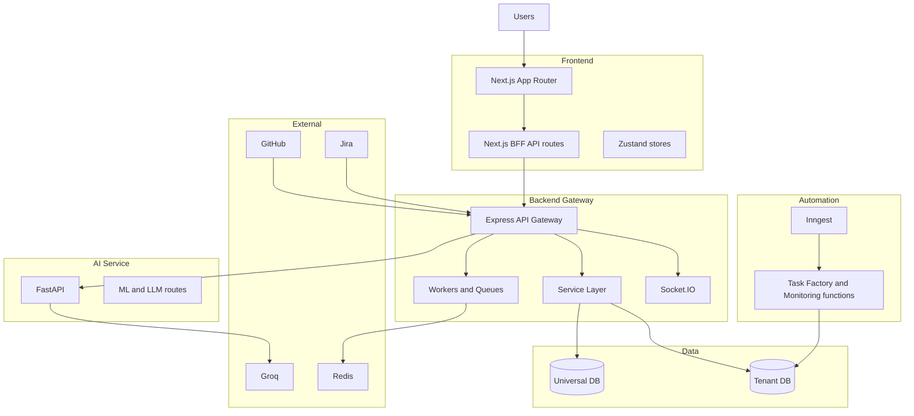

# Sprint - Agentic Scrum Manager

Sprint is a multi-tenant Agile delivery platform that combines a Next.js product UI, a Node.js API gateway, and a Python AI service.

It helps engineering teams run sprints with less manual coordination by automating planning, assignment, monitoring, and reporting flows. The system integrates with GitHub and Jira, tracks team load and sprint health, and exposes agent-driven automation via Inngest events.

## What Makes It Different
- Multi-tenant architecture with universal metadata DB and per-organization tenant databases.
- BFF API layer in Next.js (`app/api/*`) that keeps browser auth and backend proxying simple.
- Event-driven automation with Inngest for issue-to-task pipelines and monitoring pulses.
- Hybrid AI architecture: Node gateway orchestration plus FastAPI ML/LLM service.
- Built-in operations model with webhook retry/DLQ, workers, and real-time Socket.IO project feeds.

## Architecture Overview



## Tech Stack

| Layer | Technology | Why chosen |
|---|---|---|
| Frontend | Next.js 16 + React 19 + Tailwind | App Router UX and unified frontend/backend route model |
| State | Zustand | Lightweight global state for UI and agent feeds |
| API Gateway | Node.js + Express | Mature middleware ecosystem and predictable API routing |
| Realtime | Socket.IO | Project room updates for approvals and agent actions |
| Database | PostgreSQL (Neon compatible) | Strong relational model and tenant isolation support |
| Background Jobs | BullMQ + Redis | Durable retries and operational control |
| Event Orchestration | Inngest | Durable event functions with run observability |
| AI Service | FastAPI + Python ML stack | Practical ML/LLM integration and model lifecycle support |

## Repository Layout

```text
.
+-- app/                          # Next.js pages and BFF API routes
¦   +-- (dashboard)/
¦   +-- api/
¦   +-- auth/
+-- components/                   # Shared React UI components
+-- lib/                          # Next.js utility modules (DB, proxy, stores)
+-- src/store/                    # Zustand stores (agent feed and related state)
+-- inngest/                      # Event client and function implementations
+-- backend/
¦   +-- api-gateway/              # Express API gateway
¦   ¦   +-- src/routes/
¦   ¦   +-- src/services/
¦   ¦   +-- src/workers/
¦   ¦   +-- init.sql
¦   +-- ai-service/               # FastAPI AI service
+-- database/init.sql             # App schema bootstrap SQL
+-- docs/
¦   +-- product/
¦   +-- technical/
+-- tools/
```

## Local Development Setup

### Prerequisites
- Node.js 20+
- npm 10+
- Python 3.11+
- PostgreSQL 14+
- Redis 7+

### 1) Install root dependencies
```bash
npm install
```

### 2) Configure environment files
- Copy `.env.example` at repo root and set required values.
- Copy `backend/api-gateway/.env.example` to `backend/api-gateway/.env`.
- Copy `backend/ai-service/.env.example` to `backend/ai-service/.env`.

### 3) Initialize schemas
```bash
npm run init:app-db
cd backend/api-gateway
npm run init:universal-db
```

If using tenant databases, initialize the tenant template/tenant DB using gateway scripts.

### 4) Start services
Terminal 1 (gateway):
```bash
cd backend/api-gateway
npm run dev
```

Terminal 2 (ai-service):
```bash
cd backend/ai-service
pip install -r requirements.txt
uvicorn app.main:app --reload --port 8000
```

Terminal 3 (next app):
```bash
npm run dev
```

### 5) Optional: Inngest local dev
Run your Inngest dev workflow and ensure the Next.js Inngest endpoint is reachable at `/api/inngest`.

## Environment Variables

### Root (`.env.example`)
- Database: `DATABASE_URL`, `DB_*`
- Gateway: `API_GATEWAY_URL`, `API_PORT`
- AI: `AI_SERVICE_URL`, `AI_PORT`, `GROQ_API_KEY`
- Integrations: `GITHUB_*`, `JIRA_*`, `SLACK_*`
- Auth: `NEXTAUTH_SECRET`, `JWT_SECRET`, `NEXTAUTH_URL`

### API Gateway (`backend/api-gateway/.env.example`)
- Core: `UNIVERSAL_DATABASE_URL`, `PORT`, `FRONTEND_URL`
- Auth: `JWT_SECRET`, `REFRESH_TOKEN_SECRET`
- Provisioning: `TENANT_DB_PROVISIONING_MODE`, `NEON_API_KEY`
- Ops: `REDIS_URL`, `ENABLE_SCHEDULER`, `ENABLE_WORKERS`
- Integrations: `GITHUB_WEBHOOK_SECRET`, `JIRA_CLIENT_ID`, `JIRA_CLIENT_SECRET`

### AI Service (`backend/ai-service/.env.example`)
- `DATABASE_URL`
- `GROQ_API_KEY`, `GROQ_BASE_URL`, `GROQ_MODEL`

## Available Scripts

### Root
- `npm run dev` - Start Next.js development server.
- `npm run build` - Build Next.js app.
- `npm run start` - Run production Next.js server.
- `npm run lint` - Run ESLint.
- `npm run init:app-db` - Initialize app schema from `database/init.sql`.

### API Gateway (`backend/api-gateway`)
- `npm run dev` - Start Express with nodemon.
- `npm run start` - Start Express.
- `npm run init:universal-db` - Initialize universal DB schema.
- `npm run init:tenant-template-db` - Initialize tenant template DB.
- `npm run init:tenant-db` - Initialize tenant DB from connection string.
- `npm run migrate:spaces-goals-devtools` - Run migration script.
- `npm run migrate:teams-rbac` - Run migration script.
- `npm run reset:all-data` - Reset seeded data.
- `npm test` - Run gateway tests.

## API and Security Notes
- Browser clients typically hit Next.js BFF endpoints (`app/api/*`).
- BFF routes read `auth_token` cookie and proxy to gateway with Bearer auth.
- Gateway validates JWT in `Authorization` header.
- Tenant DB access is resolved from `orgId` in token claims.

## Documentation Index
- Product docs: `docs/product/`
- Technical docs:
  - `docs/technical/architecture.md`
  - `docs/technical/database-schema.md`
  - `docs/technical/agents.md`
- Contribution guide: `CONTRIBUTING.md`

## Contributing
See `CONTRIBUTING.md`.

## License
MIT
